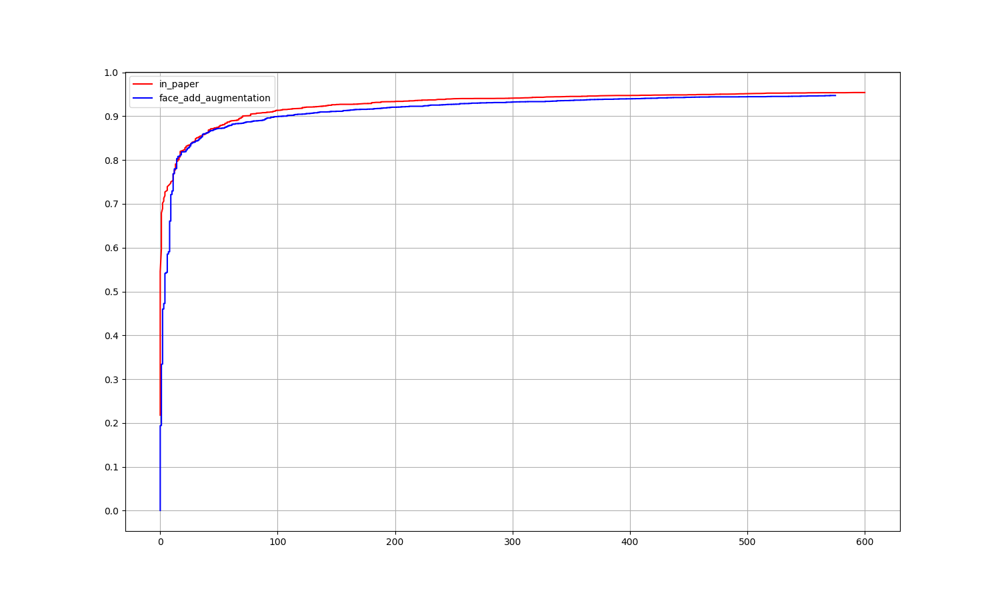

# Faceboxes
faceboxes implement by pytorch.《FaceBoxes: A CPU Real-time Face Detector with High Accuracy》
This repository is forked [lxg2015](https://github.com/lxg2015/faceboxes),and refer to [xiongzihua](https://github.com/xiongzihua/faceboxes)
and add the augmentation from SSD,and change the code to pytorch 0.41.

# Data Preparation
You should download wider face data.
Data annotation is like this:

```
data/all/image01468.jpg 1 119 185 139 139 1
data/all/image01449.jpg 2 9 39 74 74 1 409 93 77 77 1
```
format：
```
path/image_name.jpg num_face x y w h 1 x y w h 1
```

# FDDB


 
